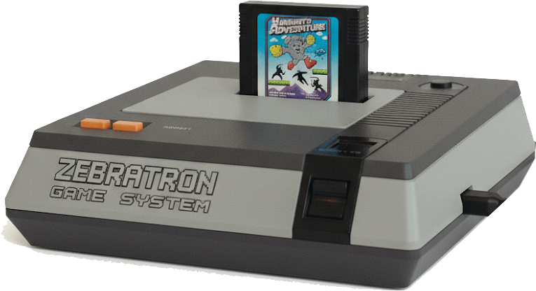

# ZebratronGameSystem

> **🎮 An Imaginary Console Aiming to Become Real**
> 
> ZebratronGameSystem is a modern implementation of a classic 8-bit console that never existed - but should have. Think of it as a "fantasy console" designed with authentic hardware constraints. We're making the software first and then working toward a prototype.

> **⚠️ Experimental Prototype Phase**
> This project is currently in early experimental development. The architecture, APIs, and functionality are rapidly evolving and subject to significant changes. Not recommended for production use at this time.

<div align="center">
  
</div>

A modern 8-bit game system inspired by classic retro consoles, designed to run at 60fps in web browsers using WebAssembly. Built with a focus on making scrolling games and classic arcade-style games easy to develop, with the long-term vision of becoming actual retro gaming hardware.

**A project by Niebo Microsystems**

> **📝 Character Attribution**
> The "Zebratron" name and the Zebratron and Hambert characters featured in this system are created and copyrighted by the artist Christopher Graybill and [Zebratron.com](https://zebratron.com), and are inspired by the original Zebratron zines and video animation series.

## 🎮 System Specifications

### Hardware Specs
- **CPU**: Virtual 8-bit processor (WebAssembly implementation)
- **Resolution**: 320×240 pixels (4:3 aspect ratio)
- **Colors**: 256 color palette, 64 simultaneous on-screen colors
- **Sprites**: 128 total sprites, 16 per scanline
- **Audio**: 8-channel wavetable synthesis
- **Memory**: 64KB main RAM, 32KB video RAM
- **Storage**: Up to 2MB ROM cartridges + optional RAM

### Developer Features
- **Scrolling Engine**: Built-in smooth scrolling with parallax layer support
- **Sprite System**: Automatic sprite management with hardware collision detection
- **Asset Pipeline**: Tools to convert modern graphics/audio to system formats
- **Scripting**: Simple scripting language for game logic
- **Debugging**: Real-time memory viewer, sprite inspector, and performance profiler
- **Hot Reload**: Live asset and code reloading during development

## 🚀 Getting Started

### Prerequisites
- Node.js 18+
- Rust toolchain with `wasm-pack`
- Modern web browser with WebAssembly support

### Quick Start
```bash
# Clone the repository
git clone https://github.com/yourusername/ZebratronGameSystem.git
cd ZebratronGameSystem

# Install Rust and wasm-pack (macOS)
brew install rust wasm-pack
# OR install via rustup
curl --proto '=https' --tlsv1.2 -sSf https://sh.rustup.rs | sh
rustup target add wasm32-unknown-unknown
cargo install wasm-pack

# Install dependencies
npm install

# Build the WebAssembly core
npm run build:wasm

# Start development server
cd runtime
npm run dev

# Open http://localhost:5173 to see the demo
```

## 🎮 Running the Demo

### Start the Demo Server
```bash
cd runtime
npm run dev
```

### Open the Demo
Navigate to **http://localhost:5173** in your browser.

### Demo Features
The demo includes:
- **Interactive Game System**: Full 8-bit emulation running in WebAssembly
- **Live Display**: 320×240 pixel canvas with test pattern rendering
- **Real-time Debug Info**: CPU registers, memory state, and FPS counter
- **System Controls**: Start, Stop, Reset buttons
- **Input Testing**: Keyboard controls for gamepad simulation

### How to Use the Demo

#### 1. **System Controls**
- **Start System**: Loads test ROM and begins emulation
- **Stop System**: Halts emulation
- **Reset System**: Resets CPU and memory to initial state

#### 2. **Game Controls** (when system is running)
- **Arrow Keys or WASD**: D-pad movement
- **Z or Spacebar**: A button
- **X or Left Shift**: B button
- **Tab**: Select button
- **Enter**: Start button

#### 3. **Visual Output**
- **Main Display**: Shows rendered graphics (test pattern by default)
- **Status Indicator**: Shows system state (Initializing → Ready → Running)
- **FPS Counter**: Real-time frame rate (should show ~60fps)

#### 4. **Debug Information**
The debug panel displays:
```
CPU: PC=$8000 A=$00 X=$00 Y=$00
SP=$FD Status=$24 Cycles: 12345
FPS: 60
```
- **PC**: Program Counter (current instruction address)
- **A, X, Y**: CPU registers
- **SP**: Stack Pointer
- **Status**: CPU status flags
- **Cycles**: Total CPU cycles executed

### Troubleshooting

#### Demo Won't Start
```bash
# Make sure you're in the runtime directory
cd runtime

# Install dependencies if missing
npm install

# Rebuild WebAssembly if needed
cd ..
npm run build:wasm
cd runtime
npm run dev
```

#### TypeScript Errors
```bash
# Check for build errors
npm run build

# Run type checker
npm run typecheck
```

#### WebAssembly Issues
```bash
# Verify Rust toolchain
rustc --version
wasm-pack --version

# Rebuild WASM module
npm run build:wasm
```

### Expected Demo Behavior

1. **Page Load**: Shows "Initializing..." status
2. **After Load**: Status changes to "Ready"
3. **Click Start**:
   - Status becomes "Running"
   - Test pattern appears (checkerboard-like pattern)
   - FPS counter shows ~60fps
   - CPU debug info updates in real-time
4. **Keyboard Input**: Keys should register (check browser console)
5. **Smooth Animation**: Pattern should render smoothly without stuttering

### Demo Architecture
```
Browser (JavaScript/TypeScript)
├── Canvas Rendering (320×240)
├── Input Handling (Keyboard → Gamepad)
├── Audio Context (Future)
└── WebAssembly Interface
    └── Rust Core
        ├── CPU Emulator (8-bit style)
        ├── PPU Graphics
        ├── APU Audio
        └── Memory Management
```

## 📁 Project Structure

```
ZebratronGameSystem/
├── core/                 # Rust WebAssembly core
│   ├── src/
│   │   ├── cpu.rs       # Virtual 8-bit CPU
│   │   ├── ppu.rs       # Picture Processing Unit
│   │   ├── apu.rs       # Audio Processing Unit
│   │   └── memory.rs    # Memory management
│   └── Cargo.toml
├── runtime/             # JavaScript/TypeScript runtime
│   ├── src/
│   │   ├── system.ts    # Main system interface
│   │   ├── renderer.ts  # Canvas/WebGL renderer
│   │   └── input.ts     # Input handling
│   └── package.json
├── tools/               # Development tools
│   ├── asset-converter/ # Graphics/audio conversion
│   ├── debugger/       # Real-time debugging tools
│   └── ide/            # Game development IDE
├── examples/           # Sample games
│   ├── hello-world/
│   ├── scrolling-demo/
│   └── platformer/
└── docs/              # Documentation
```

## 🎯 Design Goals

### Performance
- **60 FPS**: Consistent frame rate in modern browsers
- **Low Latency**: Sub-frame input response
- **Memory Efficient**: Optimized for mobile devices

### Developer Experience
- **Easy Scrolling**: Built-in smooth scrolling eliminates common pain points
- **Modern Tooling**: Hot reload, debugging, asset pipeline
- **Simple API**: Minimal learning curve for 8-bit game development
- **Cross-Platform**: Web-first with potential hardware implementations

### Authenticity
- **8-Bit Aesthetics**: Enforced palette and sprite limitations
- **Chip-Tune Audio**: Classic sound synthesis
- **Scanline Rendering**: Authentic retro visual effects
- **Memory Constraints**: Realistic limitations encourage creativity

## 📦 Cartridge System Evolution

ZebratronGameSystem is designed to evolve from the current hardcoded approach to a true cartridge-based system where games are self-contained, distributable packages.

### Current State: Hardcoded Cartridges
The system currently ships with built-in game cartridges (Hambert, Z-Synth) where all assets are compiled directly into the WebAssembly binary. This approach works great for the prototype phase but has limitations for content creation and distribution.

### Future Vision: Self-Contained Cartridge Files

#### `.zgs` Cartridge Format
```
game.zgs                    # Single cartridge file
├── manifest.toml           # Game metadata and configuration
├── graphics/
│   ├── sprites.png         # Sprite sheets with indexed colors
│   ├── backgrounds.png     # Background tile sets
│   └── palettes.pal        # Custom color palettes
├── audio/
│   ├── music.zsm           # Z-Synth music sequences
│   ├── sounds.zsf          # Sound effect samples
│   └── instruments.zsi     # Custom instrument definitions
├── levels/
│   └── *.zlv              # Level data and layouts
└── code/
    ├── main.zvm           # Game logic bytecode
    └── scripts/*.zs       # Additional game scripts
```

#### Development Workflow
1. **Asset Creation**: Artists create sprites/audio in standard tools (Aseprite, Audacity, etc.)
2. **Asset Conversion**: Tools convert modern formats to ZGS-compatible indexed formats
3. **Game Assembly**: Assets and code are packaged into a single `.zgs` cartridge file
4. **Distribution**: Cartridges can be shared, installed, and played like ROM files
5. **Modding**: Community can modify and create derivative cartridges

#### Technical Benefits
- **True Modularity**: Core system becomes a pure interpreter/VM
- **Hot Reload**: Live asset updates during development
- **Version Control**: Assets and code can be managed separately
- **Collaboration**: Multiple developers can work on different aspects
- **Distribution**: Easy sharing and installation of games

### Evolution Phases

#### Phase 1: Asset Data Structures
- Design external asset format (sprites, audio, levels)
- Implement dynamic asset loading in core system
- Maintain backward compatibility with existing cartridges

#### Phase 2: Dynamic Rendering Pipeline
- Replace hardcoded sprite rendering with asset-driven system
- Implement dynamic audio sample loading
- Add asset caching and memory management

#### Phase 3: Cartridge File Format
- Define `.zgs` file structure and packaging
- Implement cartridge parsing and validation
- Add cartridge metadata and dependency management

#### Phase 4: Asset Creation Pipeline
- Build sprite/audio conversion tools
- Create cartridge packaging utilities
- Develop visual asset editors and game development tools

#### Phase 5: Distribution Platform
- Cartridge sharing and discovery system
- Version management and updates
- Community modding and derivative work support

### Migration Strategy
The transition from hardcoded to cartridge-based will be gradual:
- Existing games (Hambert, Z-Synth) will be converted to the new format as reference implementations
- The core system will support both approaches during transition
- Asset converter tools will help migrate existing content
- Clear documentation and examples will guide new cartridge development

This evolution will transform ZebratronGameSystem from a demo platform into a true game development and distribution ecosystem, while maintaining the authentic 8-bit experience that makes retro gaming special.

## 🛠️ Development Roadmap

### Phase 1: Core System (Months 1-3)
- [ ] WebAssembly CPU emulator
- [ ] Basic PPU with tile rendering
- [ ] Memory management system
- [ ] Simple audio synthesis
- [ ] JavaScript runtime interface

### Phase 2: Graphics & Audio (Months 4-6)
- [ ] Sprite rendering with collision detection
- [ ] Multi-layer scrolling engine
- [ ] Advanced audio features (envelopes, effects)
- [ ] Asset conversion pipeline
- [ ] Performance optimization

### Phase 3: Developer Tools (Months 7-9)
- [ ] Real-time debugger
- [ ] Visual sprite/tile editor
- [ ] Game development IDE
- [ ] Documentation and tutorials
- [ ] Example games

### Phase 4: Advanced Features (Months 10-12)
- [ ] Scripting language integration
- [ ] Save state system
- [ ] Networking for multiplayer
- [ ] Hardware implementation research
- [ ] Community game showcase

## 🛠️ Developer Guide

### Build System
ZebratronGameSystem uses a hybrid Rust/TypeScript build system:

#### Prerequisites
```bash
# Install Node.js (18+) and Rust toolchain
curl --proto '=https' --tlsv1.2 -sSf https://sh.rustup.rs | sh
rustup target add wasm32-unknown-unknown
cargo install wasm-pack

# macOS users can also use Homebrew
brew install rust wasm-pack node
```

#### Build Commands
```bash
# Install all dependencies
npm install

# Build WebAssembly core (Rust → WASM)
npm run build:wasm

# Build JavaScript runtime (TypeScript → JS)
npm run build

# Start development server (auto-reload)
npm run dev

# Run all tests
npm test

# Type checking only
npm run typecheck

# Lint code
npm run lint
```

#### Development Workflow
1. **Core changes** (Rust): Edit `core/src/` → `npm run build:wasm`
2. **Runtime changes** (TypeScript): Edit `runtime/src/` → auto-reload with `npm run dev`
3. **Test changes**: `npm test` for unit tests
4. **Debug**: Use browser DevTools for JavaScript, `console.log!()` macro in Rust

#### Project Structure
```
├── core/           # Rust WebAssembly engine
│   ├── src/
│   │   ├── cpu.rs     # 8-bit style CPU emulation
│   │   ├── ppu.rs     # Picture Processing Unit
│   │   ├── apu.rs     # Audio Processing Unit
│   │   ├── memory.rs  # Memory management
│   │   └── system.rs  # Main system integration
│   └── Cargo.toml
├── runtime/        # TypeScript browser runtime
│   ├── src/
│   │   ├── system.ts  # System interface
│   │   ├── input.ts   # Input management
│   │   ├── demo.ts    # Demo application
│   │   └── index.ts   # Public API
│   └── package.json
├── research/       # Documentation and analysis
└── examples/       # Sample games (future)
```

## 🎨 Artist Guide

### Color Palette System
ZebratronGameSystem uses a **128-color master palette** designed for pixel art creation.

#### Palette Organization
- **Total colors**: 128 (indices 0-127)
- **Layout**: 8 rows × 16 columns
- **Format**: RGB values, palette-indexed rendering

#### Color Families

| Range | Family | Description | Best For |
|-------|--------|-------------|----------|
| 0-15 | **Grayscale** | Black to white ramp | Shadows, highlights, monochrome |
| 16-31 | **Reds** | Deep red to pink tones | Fire, blood, warning elements |
| 32-47 | **Oranges/Browns** | Warm earth tones | Wood, desert, autumn scenes |
| 48-63 | **Greens** | Forest to lime greens | Vegetation, nature, UI elements |
| 64-79 | **Cyans** | Blue-green aquatic tones | Water, ice, cool highlights |
| 80-95 | **Blues** | Deep navy to bright sky | Sky, water, cool elements |
| 96-111 | **Purples** | Violet to magenta | Magic, night scenes, accents |
| 112-127 | **Skin/Earth** | Flesh and natural tones | Characters, dirt, natural objects |

#### Artist-Friendly Features
- **16-step grayscale** for excellent shading
- **8 tones per color family** enable smooth gradients
- **Dedicated skin tone range** for character art
- **Earth tone section** for natural environments
- **Balanced warm/cool distribution** across spectrum

#### Color Test Demo
Press **Enter** in the demo to view all 128 colors:
```bash
npm run dev
# Open http://localhost:5174
# Press Enter to toggle color test mode
```

#### Pixel Art Tips
1. **Use grayscale first** - Design in monochrome, then add color
2. **Limit per-sprite colors** - 3-4 colors maximum for authentic feel
3. **Leverage gradients** - Each family has smooth progressions
4. **Skin tone variety** - Multiple options for diverse characters
5. **Earth tones for backgrounds** - Natural-looking environments

#### Technical Constraints
- **Sprite sizes**: Flexible (8×8 to 64×64+ supported)
- **Colors per sprite**: No hard limit, but 3-4 recommended for style
- **Screen resolution**: 320×240 pixels
- **Simultaneous sprites**: 128 maximum, 16 per scanline

### Asset Creation Workflow
1. **Design in external tools** (Aseprite, GIMP, etc.)
2. **Use palette constraint** - Limit to ZebratronGameSystem colors
3. **Export as indexed color** - Match to palette indices
4. **Convert to sprite data** - Future: automated tools
5. **Test in system** - Use color demo and sprite system

## 🤝 Contributing

We welcome contributions! Please see our [Contributing Guide](CONTRIBUTING.md) for details.

### Development Setup
1. Fork and clone the repository
2. Install dependencies: `npm install`
3. Build the project: `npm run build:wasm && npm run build`
4. Start development server: `npm run dev`
5. Make changes and test
6. Run linting: `npm run lint && npm run typecheck`

## 📄 License

This project is licensed under the MIT License - see the [LICENSE](LICENSE) file for details.

## 🙏 Acknowledgments

### Inspiration and References

**Hardware Architecture Inspired By:**
- Classic 8-bit game consoles - CPU/PPU/APU separation model and 8-bit gaming architecture
- [PICO-8 Fantasy Console](https://www.lexaloffle.com/pico-8.php) - Color palette limitations and pixel art constraints
- [TIC-80 Fantasy Console](https://tic80.com/) - Modern retro development workflow

**Character Assets:**
- **Hambert Boy Sprites** - Character design and pixel art adapted from the original hambertBoy.js game
  - Gray dog character with red boots and distinctive personality
  - 24x20 pixel sprite format with authentic retro styling
  - Walking and idle animations maintaining original charm

**Technical References:**
- [Rust WebAssembly Book](https://rustwasm.github.io/docs/book/) - WASM integration patterns
- [wasm-pack Guide](https://rustwasm.github.io/wasm-pack/) - Build toolchain setup
- [6502 CPU Reference](http://6502.org/) - CPU architecture inspiration
- Classic console development documentation - PPU and memory mapping concepts

**Development Philosophy:**
- **Fantasy Consoles Movement** - Making game development accessible and fun
- **Retro Gaming Preservation** - Keeping 8-bit aesthetics alive for new generations
- **Modern Web Performance** - WebAssembly for near-native speed in browsers
- **Artist-Friendly Design** - Clear palette constraints that encourage creativity

### Special Thanks

- **Original hambertBoy.js** - For the beloved character and game design inspiration
- **Rust Community** - For excellent WebAssembly tooling and documentation
- **Retro Gaming Community** - For preserving and celebrating classic game design
- **Fantasy Console Developers** - For proving that limitations breed creativity
- **Contributors** - Everyone who helps make ZebratronGameSystem better

**Built with love using:**
- Rust + WebAssembly for performance
- TypeScript + Vite for modern development
- Canvas 2D API for authentic pixel rendering
- Web Audio API for chip-tune synthesis