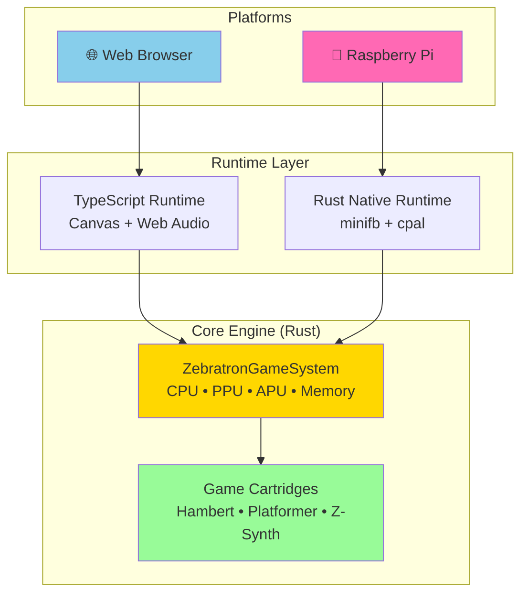
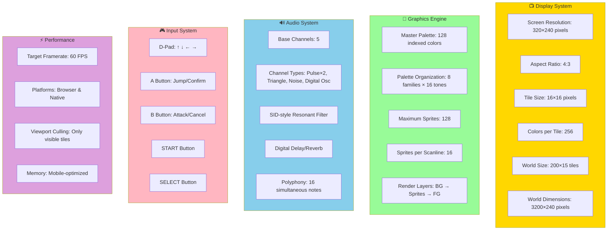

# Zebratron Game System (ZGS)

> **🎮 A Game Console with a Dream**
>
> The Zebratron Game System is a modern game framework with hardware-inspired architecture and retro constraints. Unlike traditional fantasy consoles, it's designed for dual deployment: running identically in web browsers (WASM) and on native hardware (Raspberry Pi). The goal is to eventually become a dedicated handheld console, starting with software-first development.

> **⚠️ Experimental Prototype Phase**
> This project is currently in early experimental development. The architecture, APIs, and functionality are evolving and subject to significant changes. Not recommended for production use at this time.

<div align="center">
   
  <br><br>
  
  <br>
  <em>Hambert on Miracle Mountaintop</em>
</div>

A modern 8-bit game system designed to run identically in **Web Browsers** (via WASM) and **Native Hardware** (Raspberry Pi/Desktop). Built with a focus on making scrolling games and classic arcade-style games easy to develop, with the long-term vision of becoming a dedicated handheld console.

**A project by Niebo Microsystems**

> **📝 Character Attribution**
> The "Zebratron" name and the Zebratron and Hambert characters featured in this system are created and copyrighted by the artist Christopher Graybill and [Zebratron.com](https://zebratron.com), and are inspired by the original Zebratron zines and video animation series.

## 🚀 Getting Started

ZebratronGameSystem supports two primary runtime environments.

### 1. Web Runtime (WASM)
Best for quick testing and sharing games online.

```bash
# Build the WebAssembly core
./build.sh

# Start the development server
cd runtime && npm run dev
```

### 2. Native Runtime (macOS/Linux/Pi)
Best for high performance, low-latency audio, and dedicated hardware builds.

```bash
# Build and run natively (automatically handles dependencies)
cargo run -p zebratron-runtime-native
```

*For detailed Raspberry Pi setup (libraries, etc.), see the [Developer Guide](DEVELOPER_GUIDE.md).*

## 📁 Project Structure

```
ZebratronGameSystem/
├── core/                 # Shared Rust Engine (Platform-Agnostic)
│   ├── src/
│   │   ├── ppu_clean.rs # Graphics rendering engine
│   │   ├── apu.rs       # Audio synthesis engine
│   │   └── cartridge.rs # Game logic implementations
├── runtime/             # Web Runtime (TypeScript + WASM)
├── runtime-native/      # Native Runtime (Rust + minifb/cpal)
├── TILESETS/            # Game asset data
├── tools/               # Asset converters and development tools
└── docs/                # Architecture and design guides
```

## 🎮 Execution Model

The Zebratron core is a "Single Source of Truth" that drives multiple display and audio "drivers":

```
┌──────────────┐      ┌─────────────────────────┐      ┌───────────────┐
│ Web Browser  │ ◄─── │ wasm-bindgen / web-sys  │ ◄──┐ │               │
└──────────────┘      └─────────────────────────┘    │ │               │
                                                     ├─┤ zebratron-core│
┌──────────────┐      ┌─────────────────────────┐    │ │ (Pure Rust)   │
│ Raspberry Pi │ ◄─── │ minifb / cpal / gilrs   │ ◄──┘ │               │
└──────────────┘      └─────────────────────────┘      └───────────────┘
```

## 🎯 Design Goals

### Performance

- **60 FPS**: Consistent frame rate in modern browsers
- **Low Latency**: Sub-frame input response
- **Memory Efficient**: Optimized for mobile devices

### Developer Experience

- **Easy Scrolling**: Built-in smooth scrolling eliminates common pain points
- **Modern Tooling**: Hot reload, debugging, asset pipeline
- **Simple API**: Minimal learning curve for 8-bit game development
- **Cross-Platform**: Web-first with potential hardware implementations

### Authenticity

- **Tile-Based Rendering**: Hardware-inspired PPU with viewport culling and palette indirection
- **200×15 Scrolling Worlds**: Large tilemap system with camera-based rendering
- **Sprite System**: Layer-based sprite rendering with 128-color indexed palette
- **Chip-Tune Audio**: Digital oscillators with SID-style filters and effects
- **Memory Constraints**: Authentic limitations encourage creative solutions

## 🏗️ Technical Architecture

> **📐 For detailed architecture diagrams and component documentation, see [ARCHITECTURE.md](ARCHITECTURE.md)**

### High-Level System Overview


```mermaid
graph TB
    subgraph "Platforms"
        Web[🌐 Web Browser]
        Pi[🍓 Raspberry Pi]
    end

    subgraph "Runtime Layer"
        WebRT[TypeScript Runtime<br/>Canvas + Web Audio]
        NativeRT[Rust Native Runtime<br/>minifb + cpal]
    end

    subgraph "Core Engine (Rust)"
        Core[ZebratronGameSystem<br/>CPU • PPU • APU • Memory]
        Cart[Game Cartridges<br/>Hambert • Platformer • Z-Synth]
    end

    Web --> WebRT
    Pi --> NativeRT
    WebRT --> Core
    NativeRT --> Core
    Core --> Cart

    style Core fill:#ffd700
    style Cart fill:#98fb98
    style Web fill:#87ceeb
    style Pi fill:#ff69b4
```

### 📺 System Specifications


```mermaid
graph TB
    subgraph Display["📺 Display System"]
        Screen["Screen Resolution: 320×240 pixels"]
        Aspect["Aspect Ratio: 4:3"]
        TileSize["Tile Size: 16×16 pixels"]
        TileColors["Colors per Tile: 256"]
        WorldTiles["World Size: 200×15 tiles"]
        WorldPixels["World Dimensions: 3200×240 pixels"]
    end

    subgraph Graphics["🎨 Graphics Engine"]
        PaletteColors["Master Palette: 128 indexed colors"]
        PaletteFamilies["Palette Organization: 8 families × 16 tones"]
        MaxSprites["Maximum Sprites: 128"]
        ScanlineSprites["Sprites per Scanline: 16"]
        Layers["Render Layers: BG → Sprites → FG"]
    end

    subgraph Audio["🔊 Audio System"]
        Channels["Base Channels: 5"]
        ChannelTypes["Channel Types: Pulse×2, Triangle, Noise, Digital Osc"]
        Filter["SID-style Resonant Filter"]
        Delay["Digital Delay/Reverb"]
        Poly["Polyphony: 16 simultaneous notes"]
    end

    subgraph Controls["🎮 Input System"]
        Dpad["D-Pad: ↑ ↓ ← →"]
        ButtonA["A Button: Jump/Confirm"]
        ButtonB["B Button: Attack/Cancel"]
        Start["START Button"]
        Select["SELECT Button"]
    end

    subgraph Performance["⚡ Performance"]
        FPS["Target Framerate: 60 FPS"]
        Platforms["Platforms: Browser & Native"]
        Culling["Viewport Culling: Only visible tiles"]
        Optimization["Memory: Mobile-optimized"]
    end

    style Display fill:#ffd700
    style Graphics fill:#98fb98
    style Audio fill:#87ceeb
    style Controls fill:#ffb6c1
    style Performance fill:#dda0dd
```

### PPU (Picture Processing Unit)

The PPU implements a **tile-based rendering pipeline** inspired by classic hardware:

- **Viewport Culling**: Only renders tiles visible in the 320×240 screen area, calculating `tile_start_x/y` through `tile_end_x/y` based on camera scroll position
- **16×16 Pixel Tiles**: Each tile stores 256 palette indices (16×16 array)
- **Palette Indirection**: Tiles reference a 128-color master palette, not direct RGB values
- **Scroll System**: Camera offset (`scroll_x`, `scroll_y`) adjusts all tile positions for smooth scrolling
- **Layered Rendering**: Background tiles → sprites → foreground elements
- **Large Worlds**: 200×15 tile maps = 3200×240 pixel scrolling levels

**Rendering Pipeline** (per frame):
```
1. Clear framebuffer to sky color
2. Calculate visible tile range from scroll position
3. For each visible tile:
   - Fetch tile data from tilemap[y][x]
   - Look up tile pixel array from tileset
   - Render each pixel using palette[pixel_index]
4. Render sprites over tiles
5. Copy framebuffer to canvas
```

### APU (Audio Processing Unit)

Modern audio synthesis with retro constraints:

- **5 Base Channels**: Pulse (×2), Triangle, Noise, Digital oscillator (like NES APU)
- **Polyphonic Synthesis**: Up to 16 simultaneous notes for Z-Synth cartridge
- **SID-Style Filter**: Resonant lowpass/highpass/bandpass with self-oscillation
- **Digital Delay**: Configurable echo/reverb effects with feedback
- **Sample Playback**: 8-bit PCM samples at variable rates

**Why It's Different from Fantasy Consoles:**

Unlike PICO-8 or TIC-80 which are fully self-contained development environments, ZebratronGameSystem is:

1. **Dual-Target Architecture**: Same Rust core runs in browser (WASM) AND natively (Pi/desktop)
2. **Hardware-Authentic Rendering**: Actual tile fetching and viewport culling, not a full framebuffer write
3. **External Tooling**: Uses industry-standard tools (Tiled, Aseprite) instead of built-in editors
4. **Physical Hardware Goal**: Designed from the start to become a dedicated handheld console

## 📦 Cartridge System Evolution

ZebratronGameSystem is designed to evolve from the current hardcoded approach to a true cartridge-based system where games are self-contained, distributable packages.

### Current State: Hardcoded Cartridges

The system currently ships with built-in game cartridges (Hambert, Z-Synth) where all assets are compiled directly into the WebAssembly binary. This approach works great for the prototype phase but has limitations for content creation and distribution.

### Future Vision: Self-Contained Cartridge Files

#### `.zgs` Cartridge Format

```
game.zgs                    # Single cartridge file
├── manifest.toml           # Game metadata and configuration
├── graphics/
│   ├── sprites.png         # Sprite sheets with indexed colors
│   ├── backgrounds.png     # Background tile sets
│   └── palettes.pal        # Custom color palettes
├── audio/
│   ├── music.zsm           # Z-Synth music sequences
│   ├── sounds.zsf          # Sound effect samples
│   └── instruments.zsi     # Custom instrument definitions
├── levels/
│   └── *.zlv              # Level data and layouts
└── code/
    ├── main.zvm           # Game logic bytecode
    └── scripts/*.zs       # Additional game scripts
```

#### Development Workflow

1. **Asset Creation**: Artists create sprites/audio in standard tools (Aseprite, Audacity, etc.)
2. **Asset Conversion**: Tools convert modern formats to ZGS-compatible indexed formats
3. **Game Assembly**: Assets and code are packaged into a single `.zgs` cartridge file
4. **Distribution**: Cartridges can be shared, installed, and played like ROM files
5. **Modding**: Community can modify and create derivative cartridges

#### Technical Benefits

- **True Modularity**: Core system becomes a pure interpreter/VM
- **Hot Reload**: Live asset updates during development
- **Version Control**: Assets and code can be managed separately
- **Collaboration**: Multiple developers can work on different aspects
- **Distribution**: Easy sharing and installation of games

### Evolution Phases

#### Phase 1: Asset Data Structures

- Design external asset format (sprites, audio, levels)
- Implement dynamic asset loading in core system
- Maintain backward compatibility with existing cartridges

#### Phase 2: Dynamic Rendering Pipeline

- Replace hardcoded sprite rendering with asset-driven system
- Implement dynamic audio sample loading
- Add asset caching and memory management

#### Phase 3: Cartridge File Format

- Define `.zgs` file structure and packaging
- Implement cartridge parsing and validation
- Add cartridge metadata and dependency management

#### Phase 4: Asset Creation Pipeline

- Build sprite/audio conversion tools
- Create cartridge packaging utilities
- Develop visual asset editors and game development tools

#### Phase 5: Distribution Platform

- Cartridge sharing and discovery system
- Version management and updates
- Community modding and derivative work support

### Migration Strategy

The transition from hardcoded to cartridge-based will be gradual:

- Existing games (Hambert, Z-Synth) will be converted to the new format as reference implementations
- The core system will support both approaches during transition
- Asset converter tools will help migrate existing content
- Clear documentation and examples will guide new cartridge development

This evolution will transform ZebratronGameSystem from a demo platform into a true game development and distribution ecosystem, while maintaining the authentic 8-bit experience that makes retro gaming special.

## 🛠️ Development Roadmap

### Phase 1: Core System ✅ Complete

- [x] WebAssembly runtime integration
- [x] PPU with tile-based rendering and viewport culling
- [x] Memory management system
- [x] Multi-channel audio synthesis (APU)
- [x] JavaScript/WASM runtime interface
- [x] Native runtime (Pi + desktop support)

### Phase 2: Graphics & Audio ✅ Complete

- [x] Sprite rendering with layering
- [x] Large scrolling tilemap engine (200×15 tiles)
- [x] SID-style filters and digital delay effects
- [x] 128-color indexed palette system
- [x] Collision detection and physics
- [x] Performance optimization (memory leak fixes)

### Phase 3: Cartridge System (Current Focus)

- [ ] Dynamic asset loading system
- [ ] `.zgs` cartridge file format specification
- [ ] Asset conversion tools (PNG → tileset, etc.)
- [ ] Cartridge packaging utilities
- [ ] Hot-reload development workflow

### Phase 4: Developer Tools & Distribution

- [ ] Web-based cartridge library
- [ ] Real-time debugger and profiler
- [ ] Visual tile/sprite editor integration
- [ ] Documentation and example games
- [ ] Community cartridge sharing platform

### Phase 5: Hardware Implementation

- [ ] Raspberry Pi Zero optimization
- [ ] Custom PCB design research
- [ ] Battery and display integration
- [ ] Physical controls and buttons
- [ ] Handheld console prototype

## 🛠️ Developer Guide

### Build System

ZebratronGameSystem uses a hybrid Rust/TypeScript build system:

#### Prerequisites

```bash
# Install Node.js (18+) and Rust toolchain
curl --proto '=https' --tlsv1.2 -sSf https://sh.rustup.rs | sh
rustup target add wasm32-unknown-unknown
cargo install wasm-pack

# macOS users can also use Homebrew
brew install rust wasm-pack node
```

#### Build Commands

```bash
# Install all dependencies
npm install

# Build WebAssembly core (Rust → WASM)
npm run build:wasm

# Build JavaScript runtime (TypeScript → JS)
npm run build

# Start development server (auto-reload)
npm run dev

# Run all tests
npm test

# Type checking only
npm run typecheck

# Lint code
npm run lint
```

#### Development Workflow

1. **Core changes** (Rust): Edit `core/src/` → `npm run build:wasm`
2. **Runtime changes** (TypeScript): Edit `runtime/src/` → auto-reload with `npm run dev`
3. **Test changes**: `npm test` for unit tests
4. **Debug**: Use browser DevTools for JavaScript, `console.log!()` macro in Rust

#### Project Structure

```
├── core/           # Rust WebAssembly engine
│   ├── src/
│   │   ├── cpu.rs     # 8-bit style CPU emulation
│   │   ├── ppu.rs     # Picture Processing Unit
│   │   ├── apu.rs     # Audio Processing Unit
│   │   ├── memory.rs  # Memory management
│   │   └── system.rs  # Main system integration
│   └── Cargo.toml
├── runtime/        # TypeScript browser runtime
│   ├── src/
│   │   ├── system.ts  # System interface
│   │   ├── input.ts   # Input management
│   │   ├── demo.ts    # Demo application
│   │   └── index.ts   # Public API
│   └── package.json
├── research/       # Documentation and analysis
└── examples/       # Sample games (future)
```

## 🎨 Artist Guide

### Color Palette System

ZebratronGameSystem uses a **128-color master palette** designed for pixel art creation.

#### Palette Organization

- **Total colors**: 128 (indices 0-127)
- **Layout**: 8 rows × 16 columns
- **Format**: RGB values, palette-indexed rendering

#### Color Families


| Range   | Family             | Description              | Best For                          |
| --------- | -------------------- | -------------------------- | ----------------------------------- |
| 0-15    | **Grayscale**      | Black to white ramp      | Shadows, highlights, monochrome   |
| 16-31   | **Reds**           | Deep red to pink tones   | Fire, blood, warning elements     |
| 32-47   | **Oranges/Browns** | Warm earth tones         | Wood, desert, autumn scenes       |
| 48-63   | **Greens**         | Forest to lime greens    | Vegetation, nature, UI elements   |
| 64-79   | **Cyans**          | Blue-green aquatic tones | Water, ice, cool highlights       |
| 80-95   | **Blues**          | Deep navy to bright sky  | Sky, water, cool elements         |
| 96-111  | **Purples**        | Violet to magenta        | Magic, night scenes, accents      |
| 112-127 | **Skin/Earth**     | Flesh and natural tones  | Characters, dirt, natural objects |

#### Artist-Friendly Features

- **16-step grayscale** for excellent shading
- **8 tones per color family** enable smooth gradients
- **Dedicated skin tone range** for character art
- **Earth tone section** for natural environments
- **Balanced warm/cool distribution** across spectrum

#### Color Test Demo

Press **Enter** in the demo to view all 128 colors:

```bash
npm run dev
# Open http://localhost:5174
# Press Enter to toggle color test mode
```

#### Pixel Art Tips

1. **Use grayscale first** - Design in monochrome, then add color
2. **Limit per-sprite colors** - 3-4 colors maximum for authentic feel
3. **Leverage gradients** - Each family has smooth progressions
4. **Skin tone variety** - Multiple options for diverse characters
5. **Earth tones for backgrounds** - Natural-looking environments

#### Technical Constraints

- **Sprite sizes**: Flexible (8×8 to 64×64+ supported)
- **Colors per sprite**: No hard limit, but 3-4 recommended for style
- **Screen resolution**: 320×240 pixels
- **Simultaneous sprites**: 128 maximum, 16 per scanline

### Asset Creation Workflow

1. **Design in external tools** (Aseprite, GIMP, etc.)
2. **Use palette constraint** - Limit to ZebratronGameSystem colors
3. **Export as indexed color** - Match to palette indices
4. **Convert to sprite data** - Future: automated tools
5. **Test in system** - Use color demo and sprite system

## 🤝 Contributing

We welcome contributions! Please see our [Contributing Guide](CONTRIBUTING.md) for details.

### Development Setup

1. Fork and clone the repository
2. Install dependencies: `npm install`
3. Build the project: `npm run build:wasm && npm run build`
4. Start development server: `npm run dev`
5. Make changes and test
6. Run linting: `npm run lint && npm run typecheck`

## 📄 License

This project is licensed under the MIT License - see the [LICENSE](LICENSE) file for details.

## 🙏 Acknowledgments

### Inspiration and References

**Hardware Architecture Inspired By:**

- **Nintendo Entertainment System (NES)** - PPU tile rendering, scanline timing, APU channel structure
- **Commodore 64 SID chip** - Resonant filters, digital synthesis, envelope control
- **Sega Master System** - Large scrolling tilemaps and palette-based sprite system
- [PICO-8 Fantasy Console](https://www.lexaloffle.com/pico-8.php) - Constraints-driven creativity, limited palette aesthetics
- [TIC-80 Fantasy Console](https://tic80.com/) - Modern retro development workflow and external tool integration

**Character Assets:**

- **Hambert Boy Sprites** - Character design and pixel art adapted from the original hambertBoy.js game
  - Gray dog character with red boots and distinctive personality
  - 24x20 pixel sprite format with authentic retro styling
  - Walking and idle animations maintaining original charm

**Technical References:**

- [Rust WebAssembly Book](https://rustwasm.github.io/docs/book/) - WASM integration patterns
- [wasm-pack Guide](https://rustwasm.github.io/wasm-pack/) - Build toolchain setup
- [6502 CPU Reference](http://6502.org/) - CPU architecture inspiration
- Classic console development documentation - PPU and memory mapping concepts

**Development Philosophy:**

- **Fantasy Consoles Movement** - Making game development accessible and fun
- **Retro Gaming Preservation** - Keeping 8-bit aesthetics alive for new generations
- **Modern Web Performance** - WebAssembly for near-native speed in browsers
- **Artist-Friendly Design** - Clear palette constraints that encourage creativity

### Special Thanks

- **Original hambertBoy.js** - For the beloved character and game design inspiration
- **Rust Community** - For excellent WebAssembly tooling and documentation
- **Retro Gaming Community** - For preserving and celebrating classic game design
- **Fantasy Console Developers** - For proving that limitations breed creativity
- **Contributors** - Everyone who helps make ZebratronGameSystem better

**Built with love using:**

- Rust + WebAssembly for performance
- TypeScript + Vite for modern development
- Canvas 2D API for authentic pixel rendering
- Web Audio API for chip-tune synthesis
